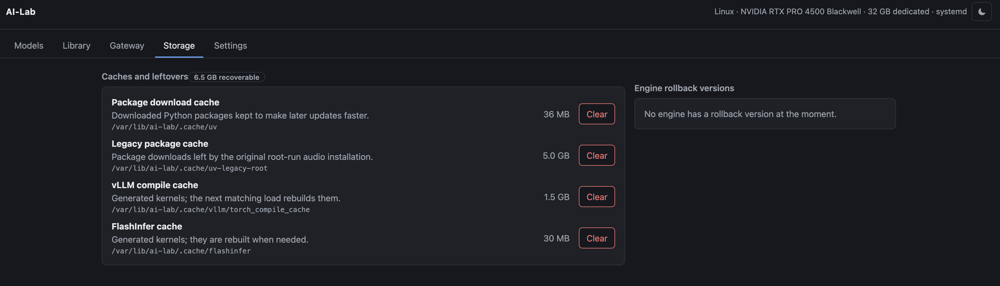

# AI-Lab

> **Built for personal use.** This is a home-lab tool that runs on one
> particular pair of machines. It is public because the measurements and the
> approach may be useful to someone; it is not a product and has no support.
> It may change over time.

_**This was written with an AI agent, and it is meant to be read the same way.**
Take it as a starting point rather than as something to install. Your machine is
not this machine: different card, different amount of memory, different models,
a different idea of what the thing should do. Point your own agent at this
repository and have it adapt the code to what you have. That is a good deal
faster than reading it all yourself, and it is how the code got here._

**One local address for text, speech and other AI models on a machine that
cannot hold them all.**

That is the whole point. A workflow may use one model to read, another to
write, one to transcribe a recording and another to detect speech. A 32 GB card
holds one of the large ones, or one large and one small. Pointed straight at the engines, a client naming a model that
happens not to be running gets a refused connection and the workflow stops
there.

AI-Lab is one address in front of all of them. A request names any configured
model; if it is loaded the request goes straight through, and if it is not,
**room is made and it is loaded first** — see [the Gateway](docs/gateway.md)
for exactly which model comes off and when. As many models stay loaded as the
memory allows, so the common case costs nothing: measured here, two models
served together answered in 0.04 and 0.08 seconds where alternating between
them used to cost a 3-second and a 7-second load.

**One thing is not standard and cannot be.** Some settings decide how a model
*process* starts — how much context it will hold, how much of the card it may
claim — and no chat API has a field for them. They travel in an `ai_lab` object
in the request body, which is specific to this project; a client that does
not send it gets the entry's configured settings and nothing breaks. See
[the `ai_lab` field](docs/requests.md#the-ai_lab-field-asking-for-a-model-started-a-particular-way).

Runs on Linux with an NVIDIA card, where systemd supervises the engines, and on
macOS with Apple silicon, where it supervises them itself. Which engines each
side supports:

- **Both:** llama.cpp, ComfyUI (images), ONNX Runtime, pyannote.audio,
  PaddleOCR, ACE-Step, Qwen3-TTS and YuE2. Higgs TTS runs on both, through a
  different engine on each.
- **Linux only:** vLLM, NVIDIA NeMo Speech, HeartMuLa, MuLaCover, and ComfyUI
  for music and for video.
- **macOS only:** MLX LM (text models in Apple's MLX format), MLX Whisper,
  Kokoro, VoxCPM, Khala and the Qwen forced aligner.

An engine the machine supports but has not installed stays visible but
disabled, with the reason. An engine the machine cannot support is not listed.

## Where things are

Each part has its own document. Every one of them says what the thing is for
before it says how it works.

**The pages**

| | |
|---|---|
| [Models](docs/models.md) | One row per configured model: what it runs, what it can do, whether it is loaded and how long the last load took. Where models are started, stopped, set up and opened in their own interface. |
| [Library](docs/library.md) | What is on disk, per weight format, in production or benchmark storage, and a search of Hugging Face to download more. |
| [Gateway](docs/gateway.md) | The address an agent talks to. What is loaded, what is queued, and **the rules by which models are loaded and unloaded** — the part nobody can guess. |
| [Storage](docs/storage.md) | Cache, incomplete files and inactive engine versions whose space can be reclaimed. Model deletion stays in Library. |
| [Settings](docs/settings.md) | What this machine is, how much of its memory models may use, engine updates, and where the two model stores live. |

**Using it**

| | |
|---|---|
| [Writing a request](docs/requests.md) | Chat and multipart audio requests, the `ai_lab` field for startup settings, and what a refusal contains so a client can correct itself. |
| [Using a model directly](docs/direct-use.md) | A loaded model's own web page: llama.cpp's chat, ComfyUI, and the upstream speech and music editors. Other engines remain available through the API. |
| [Music generation](docs/music.md) | The six music engines (ACE-Step, HeartMuLa, YuE2, MuLaCover, Khala, ComfyUI), what each accepts, direct use and agent API. |
| [Updating an engine](docs/engines.md) | Reading what an update brings before taking it, and installing beside what already works so there is a way back. |
| [Audio](docs/audio.md) | Speech-to-text, VAD, speaker diarization, transcript alignment and speech synthesis, their endpoints, and the public Data-Lab method used to prepare this personal project's Romanian evaluation audio. |
| [Media jobs](docs/media-jobs.md) | Music, speech and video requests that run in the background: submit, poll, cancel. For agents and scripts. |

**How it works inside**

| | |
|---|---|
| [Gateway behavior](docs/gateway-behavior.md) | What happens when models are switched, how long the gateway waits for an engine, and the timeout settings. |
| [Source build versions](docs/source-builds.md) | Engines compiled from source (llama.cpp): each version in its own folder, switching back, deleting. |
| [Package-installed versions](docs/package-installs.md) | Engines installed from PyPI (vLLM and others): each version in its own environment, verify, switch, delete. |
| [Architecture](ARCHITECTURE.md) | The module map: which file does which job and which may import which. |
| [Model storage](MODEL_STORAGE.md) | How model files are laid out on disk and moved between core and benchmark storage. |

## What it looks like

Two models loaded at once, each with what it runs, what it can do — a wrench
for tool calling, a photograph for reading pictures — the weight format, the
engine, and how long its last load took. More in [Models](docs/models.md).

The address to point an agent at, what is loaded right now, and the queue read
as what is about to happen rather than as a list of requests. More in
[Gateway](docs/gateway.md).

Installed engine versions and available updates, the machine's memory reserve,
and every path the installation depends on. More in
[Settings](docs/settings.md).

Caches and leftovers that actually exist, plus inactive engine versions kept
as a way back after an update. Model files remain the Library's responsibility.
More in [Storage](docs/storage.md).

## Licence

MIT. See `LICENSE`.

## Origin

This project was designed iteratively as a human–AI collaboration: human intent, architecture, review and hardware validation combined with AI-assisted investigation and implementation.
