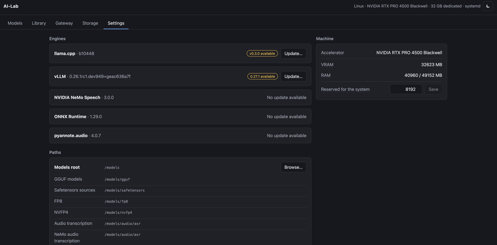

# AI-Lab

> **Work in progress, built for personal use.** This is a home-lab tool that
> runs on one particular pair of machines, and it is still being changed
> frequently. It is public because the measurements and the approach may be
> useful to someone; it is not a product, has no support, and makes no promise
> of staying still.

**This was written with an AI agent, and it is meant to be read the same way.**
Take it as a starting point rather than as something to install. Your machine is
not this machine: different card, different amount of memory, different models,
a different idea of what the thing should do. Point your own agent at this
repository and have it adapt the code to what you have. That is a good deal
faster than reading it all yourself, and it is how the code got here.

**It is still being built.** Things move; expect the odd rough edge.

Provides a manager for local inference engines. It shows what models are on disk, what
is loaded on the accelerator right now, and how long a model took to load —
and it moves models on and off, measuring every step.

Runs on Linux with an NVIDIA card, where systemd supervises the engines, and
on macOS with Apple silicon, where it supervises them itself. llama.cpp works
on both. vLLM works on the Linux machine and is shown greyed out on the Mac,
with the reason — it needs CUDA, and Apple silicon offers Metal.

Read `ARCHITECTURE.md` before changing anything.

## What it looks like

One line per configured model: what you called it, which model it runs, and —
at the right, against the buttons — the weight format and the engine that will
serve it. Port, context, temperature, state and the timings of the last load
live in the tooltip, because they are wanted occasionally and were costing three
lines of screen every time.


Settings reports the engines and the accelerator. llama.cpp is built from
source here, so its build number is shown and a newer one can be fetched and
compiled from this page. vLLM is a package rather than a source build, which is
why it has no version beside it and no update button.



## One address for an agent

An agent workflow uses several models — one to read, one to write, one to
check. Each is a separate entry here, on its own port, and only one of them can
be on the card at a time. Pointed straight at the engines, an agent naming a
model that happens not to be running gets a refused connection, and the
workflow stops there.

The Gateway is one address in front of all of them, speaking the OpenAI shape
that agent tools already send:

```sh
curl http://ai-lab.lan:8090/v1/chat/completions \
  -H 'Content-Type: application/json' \
  -d '{"model": "reviewer", "messages": [{"role": "user", "content": "hello"}]}'
```

Name any configured model. If it is the one on the card, the request goes
straight through. If it is not, the card is emptied and that model is loaded
first — the agent waits longer for that one request and sees nothing else. No
API key is checked; any value will do. `GET /v1/models` lists every configured
entry, loaded or not, which is the point: a client is meant to be able to ask
for one of them.

Two rules, both deliberate:

**One model on the card, with no exceptions.** A request that needs no switch
still unloads anything else it finds running.

**One request at a time.** Every request takes the card in turn and holds it
until the last byte of its answer has been written, streamed answers included,
so a swap can never pull a model out from under one. The consequence is worth
stating plainly: **two agents on this machine do not run in parallel.** The
second waits for the first. Running them at the same time needs a second
machine.

The Gateway page reports what this is costing. The number to read is switches
as a share of requests: a workflow changing model on most of its steps spends
its time loading rather than working, and the fix is to reorder the workflow so
that steps sharing a model run together, not to change a setting here.

Load and Unload on the Models page reach the engines directly, so they ask
first when the card is mid-answer, and offer to stop it anyway. A wedged model
has to be stoppable — but by decision rather than by accident.

### Two ways of writing a request

Nearly every client speaks the shape above. A client written against
Anthropic's own library speaks a different one and posts to `/v1/messages`
instead. Both are accepted here.

Not every engine answers both. vLLM does; llama.cpp does not. An entry asked
for a shape its engine cannot answer is refused by name, before anything is
loaded, and told which entries would have worked:

```
gemma-general runs on llamacpp, which does not answer /v1/messages.
Configured models that do: coder-fast, glm-flash, qwen36-nvfp4, text-bulk.
```

Which shapes each entry answers is in `GET /v1/models`, so a client can look
rather than guess. The engine declares it, so adding a shape — or an engine
that speaks one — is a line in that engine's file and nothing else changes.

### Running Claude Code against a model on your own card

This works, and it needs one setting most models do not have on by default.

An agent that uses tools needs the engine to understand how *this* model writes
a tool call. A model does not return structured data when it wants to use a
tool; it writes text, and every model family writes it differently. vLLM has to
be told which to expect, and refuses tool use outright until it is. That is the
**Tool calling** setting on the entry: empty means off, otherwise it names the
model's family — `qwen3_coder`, `gemma4`, `glm47`.

With that set, and a context window big enough for the agent's own prompt:

```sh
ANTHROPIC_BASE_URL=http://ai-lab.lan:8090 ANTHROPIC_AUTH_TOKEN=local ANTHROPIC_MODEL=coder-fast CLAUDE_CODE_MAX_CONTEXT_TOKENS=98304 claude -p "read note.txt and tell me which colour it mentions"
```

Measured here on an RTX PRO 4500 with Qwen3-Coder-30B at NVFP4: Claude Code
sends about 108,000 characters of prompt and tool definitions before your own
question, so 32k of context is not enough. 128k did not fit either — vLLM
wanted 12 GiB of cache and had 10.78 — and said so, naming 117,776 as the
largest that would. 96k fits, loads in 70 seconds, and leaves the card at
29.6 GB of 32.6.

## Structure

```text
ai_lab/hosts/           Platform: processes and accelerator, per operating system
ai_lab/engines/         One file per inference engine
ai_lab/downloads/       Hugging Face browsing and whole-set transfers
ai_lab/api/             HTTP routing and the progress event stream
ai_lab/web/             Browser interface, native ES modules, no build step
ai_lab/gateway.py       One address for an agent: routing by model name, and swapping
ai_lab/catalog.py       Finding models on disk, grouping shards into sets
ai_lab/runtime.py       Load, unload and swap, with measured timings
ai_lab/settings.py      The settings view
ai_lab/builds.py        Engine source versions, and updating them from git
ai_lab/operations.py    Joining the services into whole actions
ai_lab/config.py        Reading and writing config.json
ai_lab/naming.py        Rules about model file names
ai_lab/types.py         Shared data structures
ai_lab/events.py        Publishing progress to subscribers
ai_lab/wiring.py        Object construction only
ai_lab/main.py          Entry point: read the arguments, build, serve
tests/                  Unit tests, mirroring the package layout
system/                 systemd units and the one privileged helper
scripts/deploy.sh       Test and deploy to the AI-Lab container
docs/screenshots/       The interface, for the README
ARCHITECTURE.md         What each module is for, and what it must not contain
MODEL_STORAGE.md        Model store layout and NVIDIA weight formats
CLAUDE.md               Working rules for this project
opts/                   The private half: machines, credentials, real config
```

Read `ARCHITECTURE.md` before changing anything: it records the single
dependency direction the modules follow and the reason for it.

Runtime data is intentionally separate:

- application configuration: `/etc/ai-lab/config.json`, edited through the
  interface. The `config.json` in this repository seeds a fresh machine and is
  never copied over a running one, because instances created from the interface
  live in that file
- application state: `/var/lib/ai-lab`
- models: `/models`, a bind mount of the model volume on the internal disk, organised by weight format (see `MODEL_STORAGE.md`)
- deployed source: `/opt/ai-lab`

Generated state, virtual environments, logs and downloaded model weights stay
outside Git entirely.

## Deploying

`scripts/deploy.sh` tests locally, ships the tree, tests again on the far side
and restarts the manager. It has no address built into it — say which machine:

```sh
AI_LAB_HOST=root@proxmox.lan AI_LAB_CTID=102 ./scripts/deploy.sh
```

## Licence

MIT. See `LICENSE`.

## Local development

The application uses the Python standard library and supports Python 3.11 or newer.

```bash
python3 -m unittest discover -t . -s tests
python3 -m venv .venv
.venv/bin/pip install -e .
```

The tests need neither a GPU nor a network: the host and the engine are passed
in, so a fake stands in for both, and model directories are built from empty
files.

To run the manager on this machine:

```bash
./scripts/run-local.sh
```

On macOS it can instead run automatically after login, restart if it crashes,
and expose Open, Start, Stop and Restart from a menu bar icon:

```bash
./scripts/install-macos-service.sh
```

The installation is per user. It creates one Login Item for the small menu bar
app in `~/Applications`. That app owns the manager process, so Stop keeps it
stopped and a crash does not restart it. Logs are written to
`~/Library/Logs/AI-Lab`. To remove those installed files without touching the
configuration, logs or models:

```bash
./scripts/uninstall-macos-service.sh
```

It replaces any copy already running. There is no deployment step locally, so a
manager left running from before an edit keeps serving the old code, and the
symptom is confusing — the page looks wrong in a way the source says it cannot
be.

The full UI depends on Linux services, NVIDIA tooling and the model filesystem. Unit tests run locally on macOS; integration and GPU validation run in the LXC container.

## Deployment

`scripts/deploy.sh` performs the guarded deployment flow:

1. runs all tests locally;
2. streams the complete versioned project to the LXC runtime directory;
3. installs the versioned configuration, helpers and systemd units;
4. installs the package in the existing container environment;
5. runs the same tests inside the container;
6. restarts the web manager only after both test stages pass and checks that it is active.

Defaults target Proxmox host `mv` and LXC `102`. They can be overridden without editing the script:

```bash
AI_LAB_HOST=root@proxmox-host AI_LAB_CTID=102 scripts/deploy.sh
```

Downloaded models, mutable application state and active inference services are preserved during deployment.

## Safety model

The interface is intended for a trusted private network and does not implement application-level authentication. Operations that mutate state are guarded in the UI, while privileged service and model controls are restricted to narrowly scoped helpers.

## Origin

This project was designed iteratively as a human–AI collaboration: human intent, architecture, review and hardware validation combined with AI-assisted investigation and implementation.
