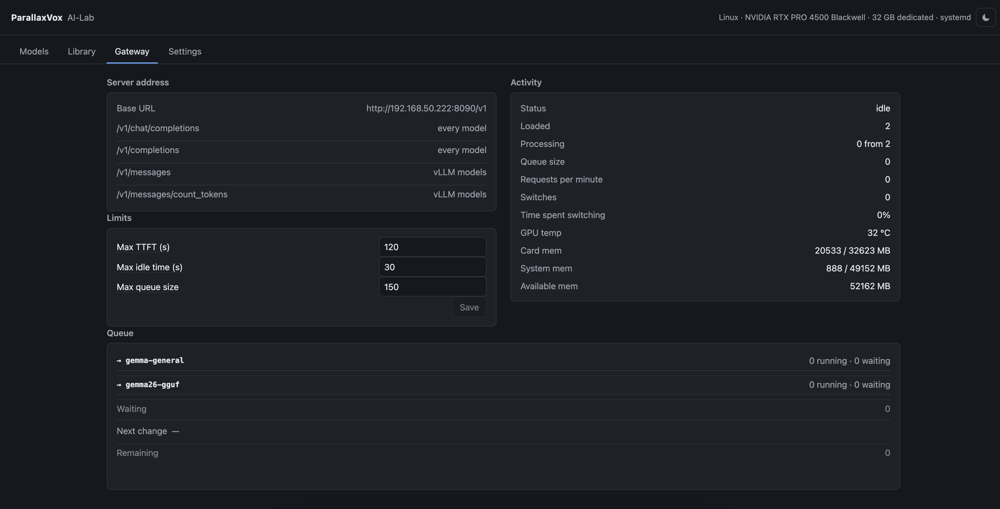

# The Gateway — one address for every model

The part an agent talks to, and the part nobody can guess: which model is
loaded, which comes off to make room, and when. If you read one document
here, read this one.

Each configured model is a separate engine on its own port. Pointed straight at
those, a client naming a model that happens not to be running gets a refused
connection. The Gateway is one address in front of all of them. It exposes the
OpenAI text and audio shapes supported by the configured engines, plus the
Anthropic Messages shape where the engine supports it:

```sh
curl http://ai-lab.lan:8090/v1/chat/completions \
  -H 'Content-Type: application/json' \
  -d '{"model": "reviewer", "messages": [{"role": "user", "content": "hello"}]}'
```

Name any configured model. No API key is checked; any value will do.
`GET /v1/models` lists every configured entry, loaded or not, which is the
point: a client is meant to be able to ask for one of them.

The **Server address** block is the contract of this particular installation.
It lists the endpoints available now and which configured models can answer
each one. That includes chat and completion requests, Anthropic messages and
token counting, transcription, voice-activity detection and speaker
diarization. An endpoint absent from this block is not served here.

### OCR and image workflows

OCR is exposed at `POST /v1/images/ocr` and uses an isolated PaddleOCR 3.x
runtime. Image generation and editing are exposed at
`POST /v1/images/generations` and `POST /v1/images/edits`. Callers select an
operator-defined profile; arbitrary ComfyUI graphs are never accepted.

Set `async: true` to receive a durable job immediately. Poll
`GET /api/image-jobs/{id}`, list with `GET /api/image-jobs`, and cancel with
`DELETE /api/image-jobs/{id}`. Unfinished jobs are explicitly failed after a
manager restart. Prompts and uploaded image bytes are not written to job
metadata, and temporary inputs are removed after completion.

ComfyUI runs behind a private adapter and is deliberately single-concurrency:
its interrupt endpoint affects the current global execution. Workflow files
must be exported in API format and stored below `images.workflow_root`.



The rest of the page is what is happening now, and every figure on it says what
it means when you hover it.

**Loaded** is how many models are on the machine; the queue below names them.
**Processing** is requests in flight against the places every loaded model
offers between them — places are the engine's own number and differ per model.
**Queued** is everything waiting its turn, whether for a place on a loaded
model or for one that has to be loaded first; the queue below says which is
which.

**Loads** counts models put on, **Evictions** counts models pushed off to make
room — the second is the one that hurts, because it costs the next request for
whatever was displaced. **Time spent switching** is the share of the working
time that went on loading rather than answering: the number that says a
workflow is thrashing.

**Available mem is given per pool and never added up.** A model has to fit in
one of them, so `12090 card · 40065 RAM` is two separate answers. Summed, it
would read as 52 GB of room on a machine with a 32 GB card and 48 GB of memory
— a place nothing can actually go.

The **Queue** is not a list of requests, it is what is about to happen. Each
loaded model with what it is answering and what is queued for it; **Waiting**,
the total queued for models already there; **Next change**, the model that has
to be loaded next; and **Remaining**, everything held up behind that change.

### How loading and unloading is decided

**Nothing is loaded or unloaded on a timer, or in the background, or because
something looked idle.** Every change happens because a request needs it.

**A request goes straight through only if all three hold:** nobody is waiting,
the model it names is loaded, and that model has a free place. Otherwise it
joins the back of the queue.

The first of those matters more than it looks. **The moment anybody is waiting,
the door closes for everybody** — including a request for a model that is
loaded and idle, which would cost nothing to serve. That is deliberate. Let
those past and the request at the head of the queue is never served, because
under a steady stream there is always another cheap one behind it. It is not
unlikely; it is certain.

**When a request finishes** and frees a place:

- the head of the queue wants a loaded model with room — it goes in, and again
  for as many as fit;
- the head wants something not loaded — nobody goes in. Room has to be made
  first;
- room can be made — the models chosen come off and the wanted one goes on.

**When the head of the queue wants a model that is not loaded**, how much room
it needs is worked out from the settings it asked for. If that fits in what is
free, it is simply loaded and **nothing comes off**. If it does not, models are
chosen to come off until it does:

1. **Idle models first**, longest-unused among them. Taking an idle model off
   costs no waiting.
2. **Then whichever answering model has gone longest without a request** — and
   everything stops until it has finished what it is doing. Cutting an answer
   short to make room is never done automatically; only the Unload button
   offers that, and it asks.

Because the door is shut while anybody waits, the models being drained cannot
pick up new work, so that wait is bounded by whatever was already in flight.

Nothing is protected from being unloaded. A model that is answering is waited
for, not spared.

**The run taken at a switch is the requests immediately behind the head that
want the same model, and no further.** The run stops at the first request
wanting something else, however many more of the first model are behind it.
Sweeping those up too would serve requests younger than one already waiting,
and the whole point of oldest-first is that a workflow may be held up by
exactly that older request. So the cost is visible rather than hidden: a
workflow alternating between two models that cannot both fit pays a load on
every step, and the fix is to reorder the workflow, not to change a setting
here.

**Requests arriving while a model loads wait for the next round**, even for the
model being loaded. Without that, the model just loaded starves the request
that was already waiting — the door problem again with the names swapped.

**How much a model needs is worked out each time and never remembered.** For
vLLM the answer is exact: it claims `gpu_memory_fraction` of the whole card and
the setting says which. For llama.cpp the weights are taken as a floor and
nothing more — measured at a 32k context, the gap between file size and card
usage ran from **−476 MiB to +6,663** across four models, so a computed cache
figure would look precise and be wrong. What a model took last time is
knowledge about the past, and it belongs to whatever is making the requests.

**A model that will not fit however much comes off is refused before anything
is disturbed**, with the numbers to correct by — see
[When a model cannot be loaded](requests.md#when-a-model-cannot-be-loaded). Unloading what
was working to load something that was never going to fit is the worst of both.

**A model that is running but that the Gateway did not load** — started from
the Models page, or left over from a manager restart — is taken up as it is
rather than reloaded. If it is still coming up it is left for later and looked
at again, because sending requests to a port with nothing behind it is worse
than waiting.

Two consequences worth designing around:

- A model plus the settings it was started with is one thing. Two requests for
  the same model wanting different context sizes cannot both be served without
  a reload.
- **A request must not wait, inside itself, on another request to this
  gateway.** Fill every place with things that cannot finish and nothing
  finishes.

### What it costs, measured

Two llama.cpp models loaded together on the RTX PRO 4500:

| | on the card | answered in |
|---|---|---|
| `gemma-general` | 3,544 MB | 0.04 s |
| `gemma26-gguf` | 20,539 MB together | 0.08 s |

Alternating between those two used to cost a load every time — 3.1 s and 7.3 s.
Neither leaves now.

Requests to one loaded model run together, up to the number the engine was
started to serve. Measured with Qwen3-Coder-30B at eight places: eight requests
at once took 1.2 s against 3.1 s one after another.

The gateway itself costs **1 ms** over talking to the engine directly.

### What fits beside what, measured

Every model here was loaded on the RTX PRO 4500 (32,623 MiB) and the card read
afterwards:

| model | engine | on the card |
|---|---|---|
| `gemma-4-E4B` | llama.cpp | 3,902 MiB |
| `gemma-4-26B-A4B` | llama.cpp | 18,184 |
| `Qwen3.6-35B-A3B` | llama.cpp | 21,880 |
| `gemma-4-31B` | llama.cpp | 24,614 |
| `qwopus27b` | vLLM | 27,382 |
| `glm47flash` | vLLM | 28,350 |
| `gemma-4-26B-A4B` | vLLM | 28,842 |
| `coder30b` | vLLM | 29,740 |

**A vLLM model takes a share of the whole card, not what its weights need.**
`gpu_memory_fraction` is 0.9 by default, and gemma-4-26b has 17.5 GB of weights
and occupies 28.8 GB — the rest is cache for concurrent requests. So two vLLM
models at the default never fit together, and lowering the fraction is the only
thing that changes that.

**llama.cpp takes roughly its weights plus a cache.** How much cache is not
worth predicting: at a 32k context the gap between file size and card usage ran
from **−476 MiB to +6,663** across four models, because architectures differ in
how they attend. So when the weights alone will not fit, llama.cpp is told to
put on as many layers as it can and leave the rest in system memory — it
measures the card at startup, which nothing outside it can do. That is slower:
moving 20 of 80 layers off the card cut prompt reading to a ninth here.
Generation suffers far less.

---

[← all documents](../README.md)  ·  [Library](library.md)  ·  [Settings](settings.md)
