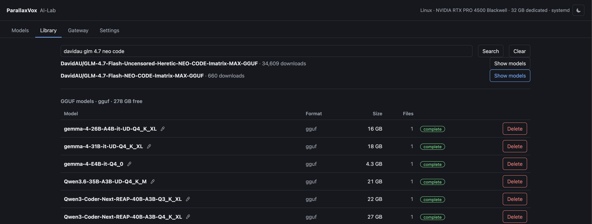

# Library — what is on disk, and what could be

Every model found on disk, grouped by weight format and task, with what it can
do and whether the set is complete. A repository may expose only a subtree,
which lets the safetensors and native `.nemo` views share `/models/audio/asr`
without listing each other's files. Below it, a search of Hugging Face: pick a
repository, see which of its models this machine can actually run, and download
one whole — never file by file, because four shards of five is a model that
fails to load with an unhelpful message.



**Clear** puts a search away and brings back what is on disk. It appears only
once there is something to clear, because a button that does nothing is one
people press once and stop trusting.

A download goes to the folder for its format, decided by the server rather than
chosen. Deleting a model is refused while a configured entry points at it, and
that refusal sends you to Models to remove the entry first — two actions on two
pages, so it is always clear which kind of data is about to disappear.

## Models that are made of parts

Most models are one folder upstream. Ask for it and everything arrives
together: the weights, the tokenizer, the settings file beside them.

Image models are not like that. One is assembled from separate pieces — the
part that draws, the part that reads your prompt, and the part that turns the
result into a picture — and upstream keeps those pieces in different folders,
sometimes in different repositories. Qwen-Image-Edit is the plain case: the
part that draws is in its own repository, and the two other parts it needs sit
in the ordinary Qwen-Image repository next door.

Nothing in a listing says which pieces belong together, and guessing gets it
wrong: one repository holds the same model at five different precisions, and
the wrong pair loads without complaint and produces rubbish. So the grouping is
written down once, in `config.json` under `downloads.bundles`, naming the exact
upstream file of every part:

```json
"downloads": {
  "bundles": [
    {"name": "qwen-image-2512-nvfp4",
     "repo": "Comfy-Org/Qwen-Image_ComfyUI",
     "format": "comfyui",
     "task": "image-generation",
     "components": [
       {"role": "diffusion_model",
        "path": "split_files/diffusion_models/qwen_image_nvfp4.safetensors"},
       {"role": "text_encoder",
        "path": "split_files/text_encoders/qwen_2.5_vl_7b_nvfp4.safetensors"},
       {"role": "vae", "path": "split_files/vae/qwen_image_vae.safetensors"}]}
  ]
}
```

A part may name a `repo` of its own when it comes from somewhere else.

From then on it behaves like any other model. Searching that repository shows
the group first, above the individual files it is made of, because those files
are each unusable alone. Downloading it fetches every part, and the library
shows **one** model rather than three — the parts land side by side in one
folder, under their own names, which is how ComfyUI expects to find them.

Three things are true of that download that are worth knowing:

- **Nothing appears until all of it has arrived.** The parts are collected in
  a working folder beside the repository, whose name begins with a dot, and
  the library does not look inside folders named that way. Only when every
  part is present and checked is the folder moved into place, which on one
  disk is a single rename. Two parts of three never look like a model.
- **Every part is checked before that move.** The size must match the listing,
  and where Hugging Face publishes a checksum — which it does for every large
  file — the bytes on disk are hashed and compared. A download that stopped
  early but left a tidy-looking file is caught here instead of by an engine
  failing to load it next week. The transfer records how many files got which
  check, so the report does not have to imply more than was done.
- **An interrupted download continues rather than restarts.** The bytes
  already fetched stay in the working folder, so asking again picks up where
  it stopped. Cancelling keeps them too.

If upstream renames one of the files, the group is reported as incomplete and
names what is missing, and the download is refused. That is deliberate: a model
with a hole in it is worse than one that never arrived.

Two parts of one group may not share a file name. They end up in the same
folder, so the second would quietly overwrite the first. A group whose name
contains a slash, or begins with a dot, is refused for the same class of
reason — the name becomes a folder in the model store.

A part shared by two groups is downloaded once for each of them. That costs
some disk and keeps each group whole and independently deletable, which is
worth more than the gigabytes on a disk kept for this purpose.

---

[← all documents](../README.md)  ·  [Models](models.md)  ·  [Audio](audio.md)  ·  [Gateway](gateway.md)
